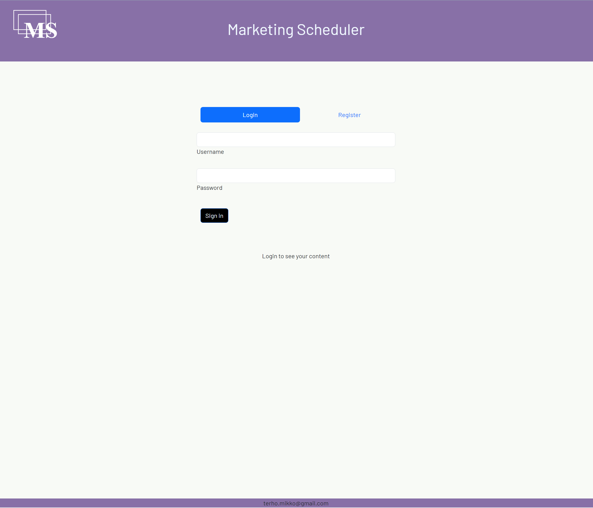
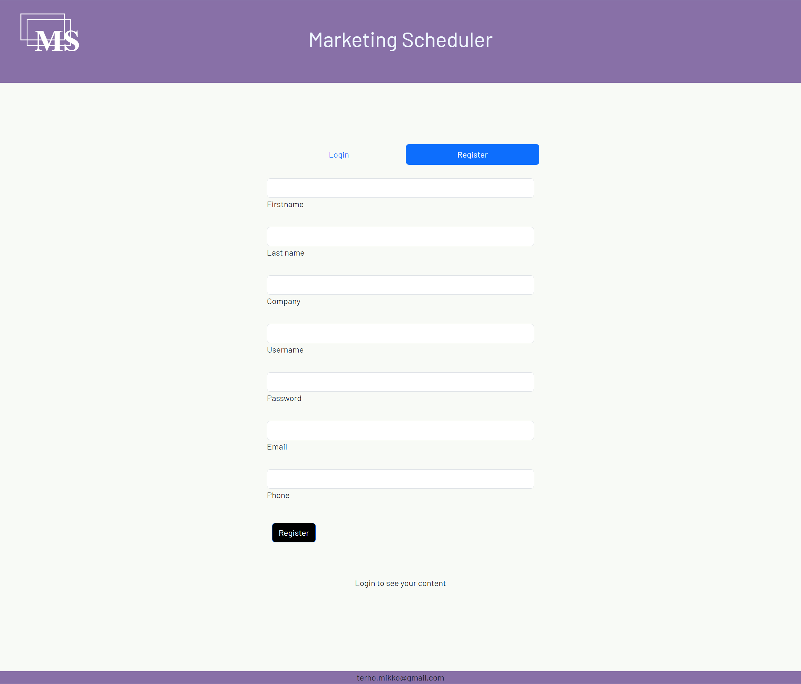
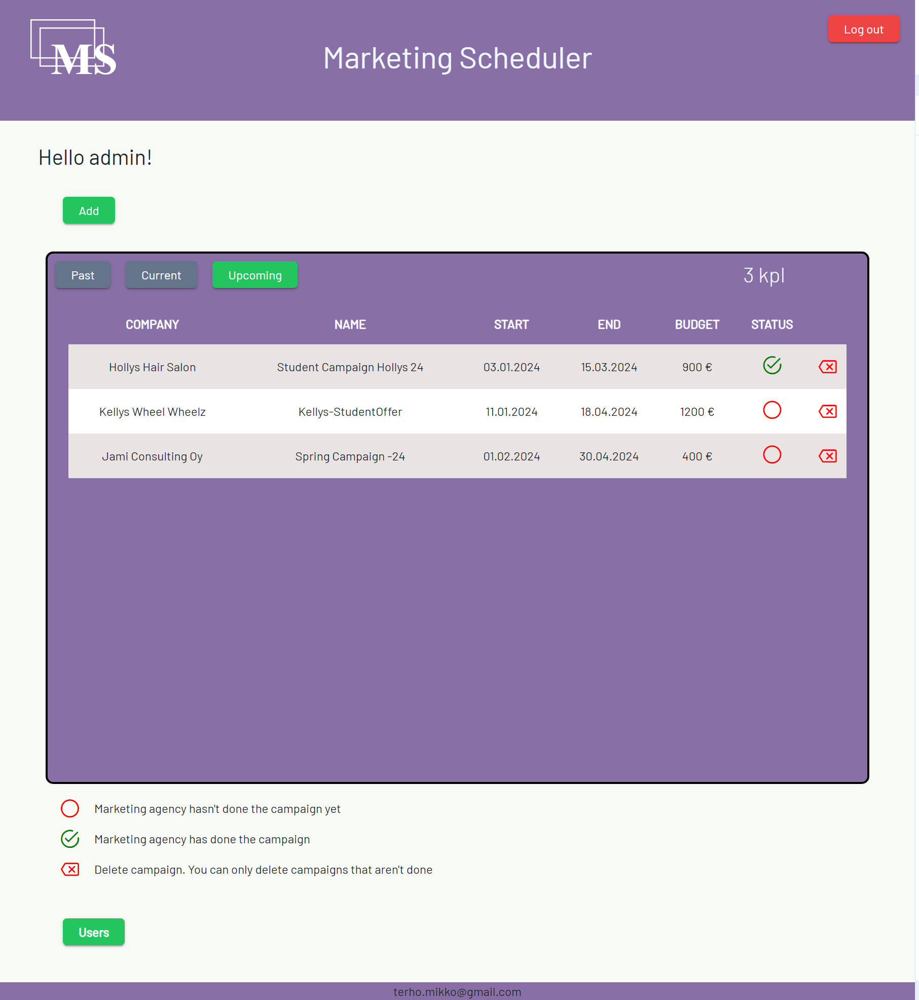
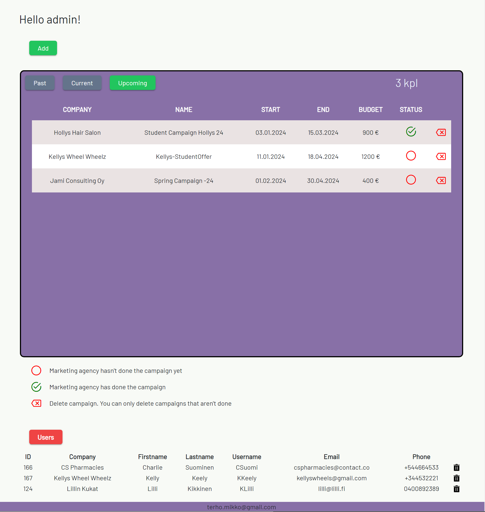
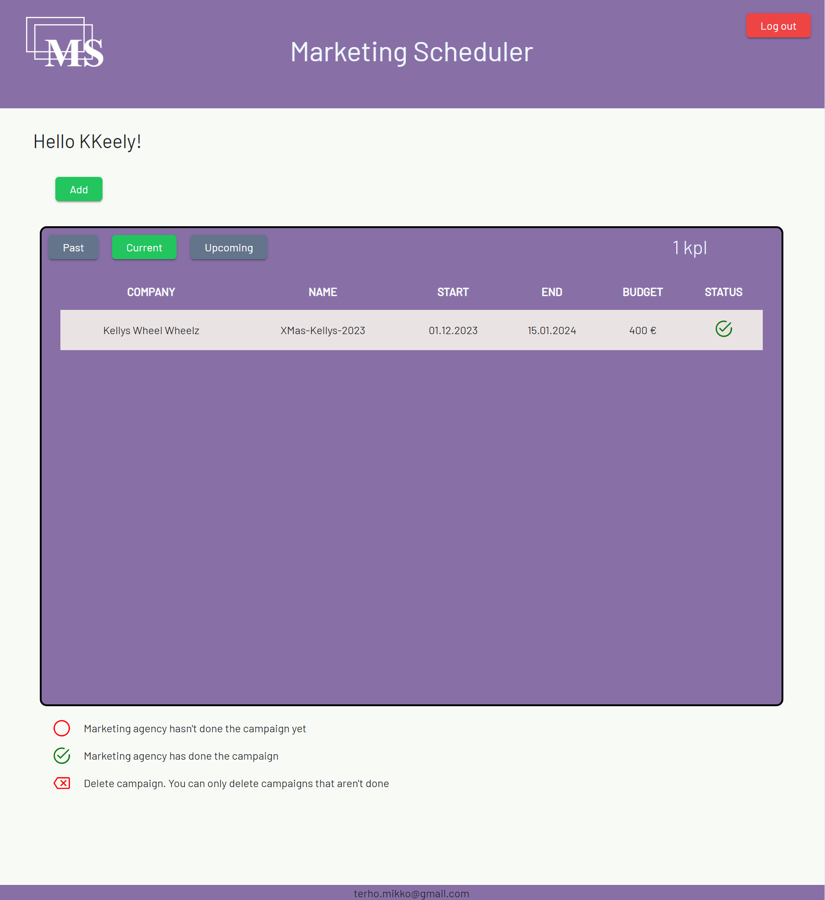
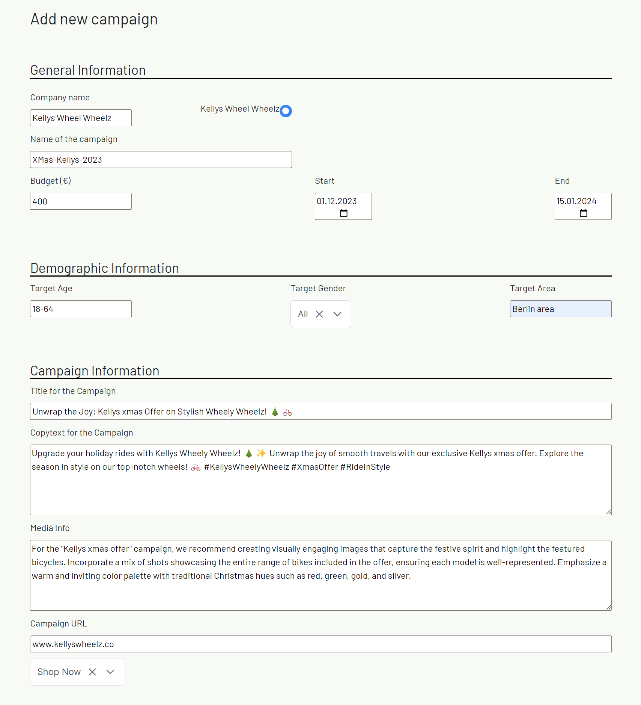
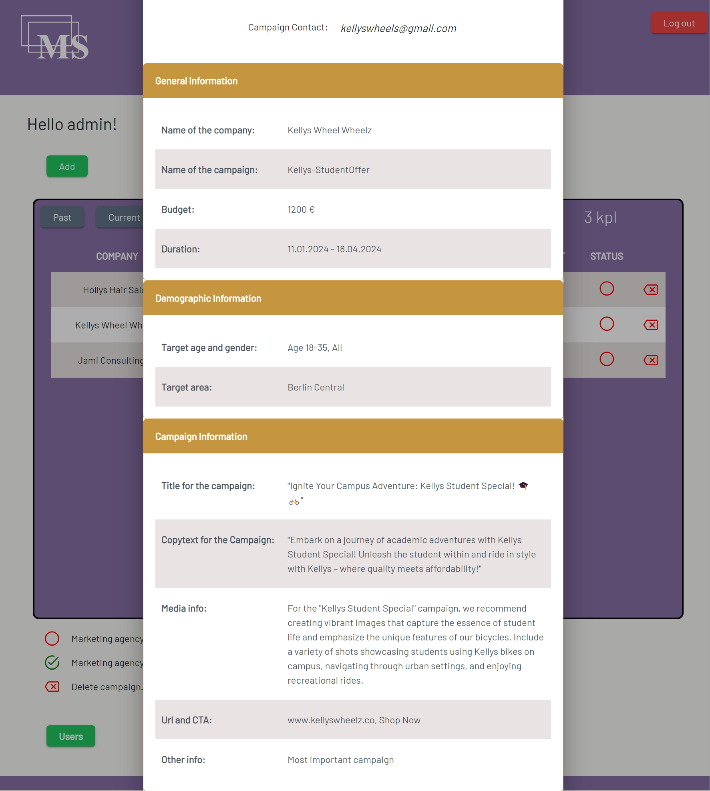

# Marketing Manager

### Currently

This project currently features registration, login, creating a campaign, viewing future, current and past campaigns.

## Installation

1. Clone the repository

   ```bash
   git clone https://github.com/tammenterho/MMfront.git
   cd mmfront
   ```

2. Install dependencies for the client and server

   ```bash
   cd mmfront
   npm install
   ```

## Usage

1. Start/Create the OracleDB database.

- You need docker desktop for this.

  ```bash
  docker pull container-registry.oracle.com/database/free:latest
  docker run -d -p 1521:1521 -e ORACLE_PASSWORD=yourpassword -v oracle-volume:/opt/oracle/oradata gvenzl/oracle
  -free
  ```

2. Create needed tables to OracleDB with DBeaver once docker container is running and connected. Check tabledata from backend [entities](https://github.com/tammenterho/MMback/tree/master/src/main/java/com/mikko/mmback/entities)

   ```bash
   cd server
   npm run dev
   ```

3. Clone server from [here](https://github.com/tammenterho/MMback.git)

4. Start the server
   ```bash
   cd server
   gradlew bootRun
   ```
5. Start the client

   ```bash
   cd client
   ng serve
   ```

6. Create admin to DB

- create admin in register application
  OR
- create admin with DBeaver
- Database must have table ready with necessary columns
- admin must have firstname: "admin", lastname: admin, username: admin.








